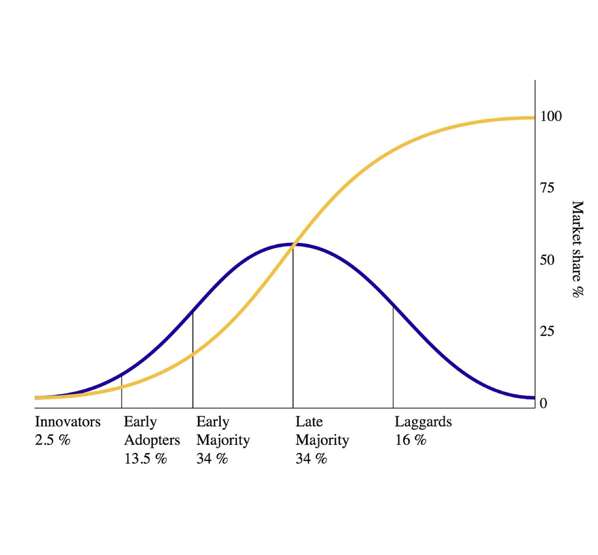
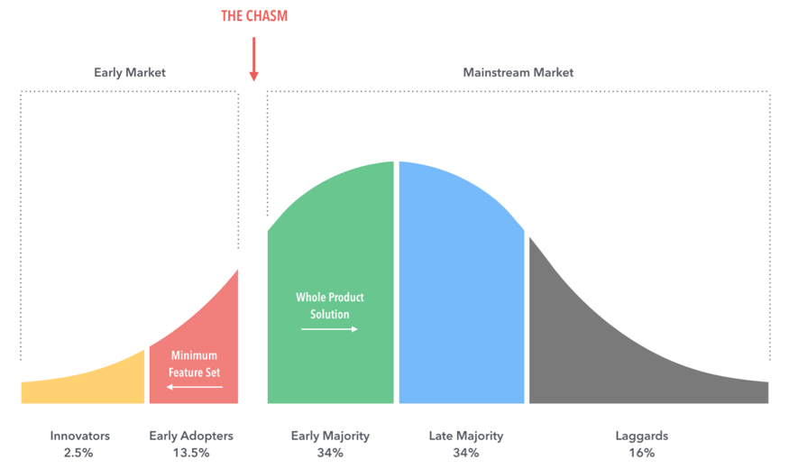
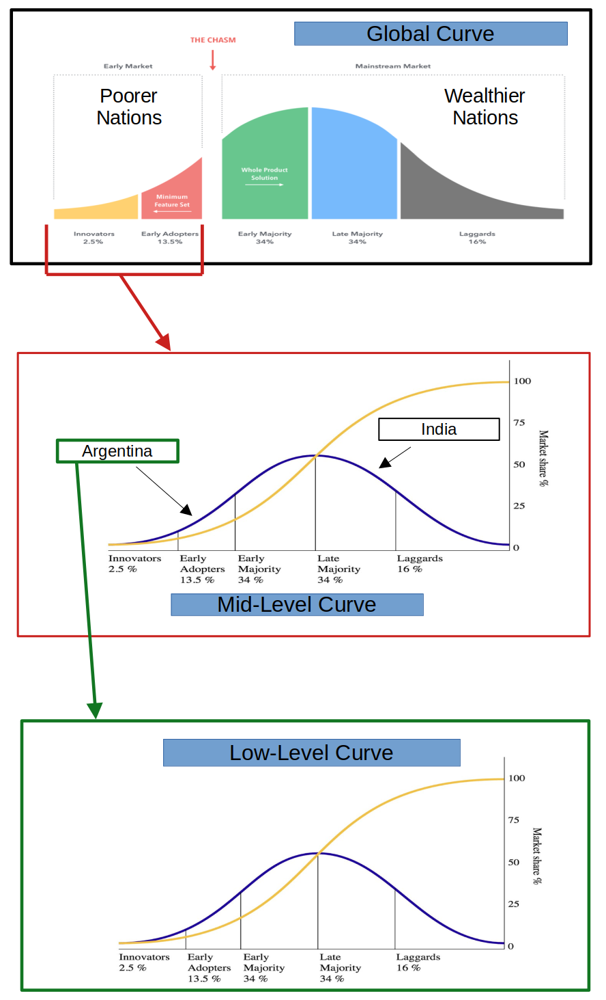

# **DeFi’s Adoption Roadmap**

> [!TIP]
> Here is an AI-generated podcast giving a deep dive on this paper (audio-only).  
> Reload the page if there is a MIME error.

## Table of Contents

- [Abstract](#abstract)
- [A Primer: The Diffusion of Innovation Theory](#a-primer-the-diffusion-of-innovation-theory)
- [Applying the Diffusion Theory to DeFi](#applying-the-diffusion-theory-to-defi)
- [Obstacles: Fact or Fiction](#obstacles-fact-or-fiction)
    - [Regulations](#regulations)
    - [Low Liquidity](#low-liquidity)
    - [Missing Internet Access](#missing-internet-access)
    - [Conclusion of Obstacles](#conclusion-of-obstacles)
- [The Evolution of DeFi Products](#the-evolution-of-defi-products)
- [Conclusion](#conclusion)

## Abstract

There are effectively two factors to consider when outlining DeFi’s adoption roadmap: 1\) the
entity’s current status quo, and 2\) the entity’s risk-tolerance. The more important factor is the
status quo – a bad status quo will make entities more desperate to look for better systems than a
good status quo. However, two entities experiencing the same status quo will not adopt the new
system at the same time – one entity may find the theory compelling enough to adopt an unproven
system while another entity will wait until there is proof that the system actually works (based on
the success of others). These two factors effectively create a layered adoption curve: a
macro-adoption curve (determined by the status quo) is composed of smaller micro-adoption curves
(determined by risk-tolerance). **This layered adoption curve is the roadmap**. DeFi adoption will
progress in order: starting with risk-tolerant entities in places with a bad status quo (e.g.,
hyperinflation, unstable institutions, etc.) and continuing until even the most risk-averse entities
in places with a good status quo adopt it. Thus the clear starting point is a poorer nation (i.e., a
developing nation) that is risk-tolerant enough to experiment with new systems (e.g., Argentina),
and more specifically the most risk-tolerant citizens within this nation. Trying to push DeFi
adoption out of order will largely result in wasted energy – regulation, low-liquidity, and missing
infrastructure are only obstacles if DeFi strays from the roadmap. DeFi products (e.g., wallets)
must be aware of DeFi’s current location on the roadmap, and evolve as DeFi’s adoption progresses.
The world is ready to start adopting DeFi now, even with very immature DeFi products.

## A Primer: The Diffusion of Innovation Theory

The Diffusion of Innovation Theory, shown below, is the foundation of this roadmap:

  
**Figure 1:** Diffusion of Innovation Theory Graph.

Figure 1 is two graphs overlaid together. The yellow line depicts market share over time. The blue
line depicts the target customer over time as well as what proportion of the overall population is
in that category. For example, the very first people to adopt a new innovation are the *Innovators*
and about 2.5% of the overall population fall into this category. After the *Innovators* adopt, then
the adoption process moves onto the next group: the *Early Adopters* who make up 13.5% of the
overall population.

These five adopter categories have distinct characteristics, and each type of adopter looks to the
prior category for inspiration and confirmation of the new innovation. The following summaries are
taken from Geoffrey Moore’s *Crossing the Chasm*, Chapter 1: 

- **Innovators:** They are extremely risk-tolerant and do not care if they have a use case for the
innovation already or not; they simply enjoy trying new innovations. They may seek them out before
any formal marketing campaign begins. They also do not care how user-friendly the innovation is
since figuring out how to make it work is part of the fun. They are effectively explorers trying to
find a use case for the new innovation.  
- **Early Adopters:** Once the *Innovators* discover possible use cases, the *Early Adopters* are
drawn to the promise of the innovation (i.e., its potential utility). Like the *Innovators*, they
are risk-tolerant and are not deterred by the lack of user-friendliness. They see the burden of
figuring out how to use the new innovation as the cost of getting a head-start on the competition
(i.e., they want [first-mover advantage](https://en.wikipedia.org/wiki/First-mover_advantage)).
Because of this, they do not wait for proof that the innovation works; the theory is enough to
convince them to adopt.  
- **Early Majority:** These adopters are like the *Early Adopters* in that they see the promise of
the innovation, but the *Early Majority* are too risk-averse to adopt it without proof that it
works. Therefore, they wait for the *Early Adopters* to find some success with it. Once they see
success, the *Early Majority* expect help with adopting the innovation but are okay with a few
lingering bugs. In other words, they care about user-friendliness more than the *Early Adopters*,
but don’t require a perfect user-experience.  
- **Late Majority:** These adopters are risk-averse like the *Early Majority* except they are not
okay with lingering bugs and inconveniences. This is when user-friendliness must be perfect. To
attract the *Late Majority*, using the innovation must be a seamless experience.  
- **Laggards:** These adopters don’t care about the new innovation at all; they only adopt out of
necessity. For example, *Laggards* only buy smartphones because flip-phones are no longer for sale.

As these summaries point out, later segments depend on the preceding segments. Focusing on
user-friendliness before the *Early Adopters* have found success is going out of order and mostly a
waste of resources. Products should rely on the adopters as much as possible. For example,
*Innovators* and *Early Adopters* make great beta testers, and can give feedback on what features
they find most important. These features should then become the focus when targeting the *Early
Majority* and *Late Majority*.

> [!IMPORTANT]
> While the above summaries use the term “adopter”, this term does not only refer to individuals. It
> refers to any entity that can decide whether or not to adopt the innovation. This means a country
> can be thought of as a single adopter as well – a country decides whether or not to build its
> institutions around the new innovation.

## Applying the Diffusion Theory to DeFi

A naive application of the Diffusion Theory to DeFi would produce a dual-layered adoption curve: a
macro-adoption curve that represents adoptions by countries (i.e., each country is an “adopter”),
and a micro-adoption curve for each country (i.e, the individuals in the country are an “adopter”).
However, this would be an inaccurate model for one reason: **there is a huge divide between
wealthier nations (i.e., First World, developed nations, Global North) and poorer nations (i.e.,
Third World, developing nations, Global South)**.

As the Diffusion of Innovation Theory implies, the underlying driving force of the adoption process
is the utility of the new innovation; but utility is relative to what alternatives are available. If
alternatives exist that are better than what the new innovation can currently offer, *the new
innovation has no utility yet.* This is where the divide between wealthier nations and poorer
nations exists.

Wealthier nations have stable currencies, highly liquid and feature rich markets, and stable
institutions. The current DeFi ecosystem – with its low-liquidity, bare features, and volatile
assets – has nothing useful to offer wealthier nations. Conversely, poorer nations do not currently
have the same conveniences as wealthier nations: their local currencies regularly experience
hyperinflation, they don’t have highly liquid and feature rich markets, and their institutions are
usually unstable. The current DeFi ecosystem is actually already better than the alternatives in
these poorer nations. This chasm between wealthier nations and poorer nations is perfectly
exemplified by Argentina, where one-third of the population is already using crypto for everyday
transactions ([source](https://beincrypto.com/learn/cryptocurrency-adoption-argentina/)). This level
of crypto adoption is not seen anywhere among wealthier nations. According to a 2024 Chainalyses
study, 16 of the top 20 countries leading DeFi adoption are poorer countries
([source](https://www.chainalysis.com/blog/2024-global-crypto-adoption-index/)).

Because of this difference between poorer nations and wealthier nations, DeFi’s global adoption
curve effectively has a giant **utility chasm** which is depicted in the following figure:  

  
**Figure 2:** The Global DeFi Adoption Curve. A utility chasm separates poorer nations from
wealthier nations: poorer nations will be willing to adopt the current immature DeFi while wealthier
nations will wait until DeFi is comparable to what they are used to in TradFi. The percentages are
percentages of global wealth, not population.

Factoring in this utility chasm, DeFi’s adoption curve actually has three layers (depicted in Figure
3):

- A global-level adoption curve where poorer nations are the early adopters and wealthier nations
are the majority that only adopt once DeFi has matured enough to be useful to them (i.e., has more
liquidity and features). *This curve’s percentages are based on the share of global wealth.*  
- A mid-level adoption curve. Not all poorer countries will adopt at the same time; some countries
are more risk-averse than others and may have regulations preventing the use of DeFi. The same also
applies to wealthier nations. So the global-level adoption curve is effectively split into two
mid-level adoption curves: one for the poorer nations and one for the wealthier nations. The utility
chasm separates the two mid-level curves.  
- A low-level adoption curve representing that individuals within a given country will have
different risk-tolerances. Risk-tolerant individuals will adopt first and their success will inspire
more risk-averse individuals to adopt. *This curve’s percentages are based on population.*

  
**Figure 3:** The three-layered adoption curve: the global curve depicts the utility chasm that
separates the poor nations from the wealthier nations, the mid-level curve depicts the
risk-tolerance of the countries within the poor/wealthy category, and the low-level curve depicts
the risk-tolerance of the individuals living in the country.

This three-layered adoption curve can effectively be summarized as answering the following
questions:

1. Global-level: Does DeFi already offer better economic opportunities than what is currently
available within a given country?  
2. Mid-level: Are the country’s regulations DeFi friendly, and does its culture encourage
risk-taking?  
3. Low-level: How successful has DeFi been at actually providing the promised economic
opportunities, and how hard is it to replicate these success stories for the rest of the
population?

> [!IMPORTANT]
> Some might argue that wealthier nations could adopt sooner than this model suggests, but this is
> not realistic; the utility chasm is too vast. Even a forward-thinking nation like Singapore would
> have no use for DeFi right now given its current limitations (e.g., low liquidity, low throughput,
> etc). Despite being crypto-friendly, Singapore is forced to wait until DeFi matures enough to
> cross the utility chasm. However, the reverse is possible: a poorer nation could be too culturally
> stubborn to adopt DeFi until well after the utility chasm is crossed. For example, an extremely
> religious nation or one ruled by a dictator could hold out for several decades; but these are rare
> exceptions. Most countries (poor and wealthy) are market-driven and will likely adopt inline with
> this model.

This layered adoption curve is backed up by empirical data. Wealthier nations dominate the global
share of wealth (which is why the global-level adoption curve uses wealth percentages) so comparing
the current cryptocurrency market capitalization to the total wealth in the world can give a rough
estimate to where DeFi adoption is on the global-level curve. As of 2025, most wealthier nations
have not adopted DeFi at all and many citizens within these nations still consider blockchain to be
a scam. This behavior matches up with an innovation that is still in the *Innovators* segment which
is indeed where the data suggests DeFi is. As of 2025, the total wealth in the world is about $450
trillion ([source](https://en.wikipedia.org/wiki/List_of_countries_by_total_wealth)) while the
current cryptocurrency market capitalization is about $3 trillion
([source](https://coinmarketcap.com/)). This puts wealth adoption at \~0.6% which falls well within
the *Innovators* adoption segment. So the global-level adoption curve is saying DeFi still has no
utility for most of the wealth in the world, and should therefore focus on poorer nations.

Zooming into the mid-level adoption curve, the layered adoption model can predict where DeFi is
within the adoption of poorer nations. As previously stated, some people in poorer nations are
already using DeFi which means it should at least be out of the *Innovators* segment (i.e., a use
case has already been discovered). Poorer nations make up 83% of the global population
([source](https://unctad.org/data-visualization/now-8-billion-and-counting-where-worlds-population-has-grown-most-and-why))
which makes the share of the global population a good metric for measuring their adoption. Estimates
of global crypto ownership is about 500 million people
([source](https://www.triple-a.io/blog/crypto-ownership-report)) which puts adoption at around 6%.
This is likely an overestimate since some people in wealthier nations also own crypto. So the
mid-level adoption curve for poorer nations is currently at the beginning of the *Early Adopter*
segment which means a use case for DeFi has been found, but its potential has not been fully
actualized yet (i.e., it is still unproven).

**DeFi’s adoption progress is currently within the *Early Adopters* segment among poorer nations.**
Therefore, DeFi products should focus on figuring out what use cases these *Early Adopters* are
trying to achieve, and help eliminate any obstacles to their success. DeFi is supposed to bank the
unbanked and provide financial opportunities to the under-served. ***Is DeFi actually doing this, or
is it still only being used for an inflation hedge and speculation?*** If it's the former, DeFi
likely just needs to be made more user-friendly to attract the *Early Majority*; but if it’s the
latter, DeFi still doesn’t have any success stories and so the focus should be on building the
proper DeFi dApps for the rest of the *Early Adopters*. The fact that DeFi is only at the beginning
of the *Early Adopters* segment within the mid-level curve for poorer nations strongly suggests the
issue is the latter – the right DeFi dApps don’t exist yet. If they already did, wouldn’t adoption
be much closer to the *Early Majority* segment?

> [!IMPORTANT]
> Remember that *Early Adopters* don’t care about user-friendliness. If they are not adopting,
> focusing on user-friendliness will not help\!

## Obstacles: Fact or Fiction

Some people argue that regulations, low liquidity, and even a lack of internet access are obstacles
to DeFi’s adoption; but actually, none of these are real obstacles. They are only obstacles if DeFi
adoption is pushed out of order.

### Regulations

Regulations should be thought of as a representation for a country’s collective risk-tolerance.
While regulations can be irrational (i.e., mostly dictated by emotions or corruption), they are not
static. If the public sees an innovation succeed elsewhere, it will shift its stance and pressure
regulations to change. As an example, consider Argentina and India: Argentina is currently more
DeFi-friendly than India
([source](https://www.globalcitizensolutions.com/crypto-friendly-countries/)). If Argentina adopts
DeFi, it will likely experience [catch-up
growth](https://www.investopedia.com/terms/c/catch-up-effect.asp) – possibly growing faster than
India over the next several years. People in India will see the dramatic quality of life
improvements happening in Argentina and desire it for themselves. India will study Argentina’s
success to try replicating it for itself. The use of DeFi will stand out and India will pivot to be
more DeFi-friendly; India will voluntarily bring down its regulatory walls keeping DeFi out. Envy is
a powerful motivator and fuels the natural human desire to [keep up with the
Joneses](https://en.wikipedia.org/wiki/Keeping_up_with_the_Joneses). Once South America’s collective
GDP rivals the United States’, even the U.S. will feel pressured to adopt DeFi.

> [!IMPORTANT]
> Anti-crypto regulation just means it isn’t time for that nation to adopt DeFi yet. They want to
> see DeFi successfully be used for more than just money-laundering and speculation. In other words,
> these nations are part of the *Early Majority* and want to see more success stories. Perhaps
> Argentina’s success alone won’t be enough to convince India to be more DeFi friendly. If that’s
> the case, DeFi adoption should focus on another more friendly nation. With every country that
> successfully adopts DeFi, anti-crypto resistance will weaken. Eventually, even India will wish to
> adopt DeFi. Even small dominoes can build until they are able to knock over exponentially larger
> dominoes.

### Low Liquidity

The liquidity requirements for wealthier nations are **vastly different** from the liquidity
requirements for poorer nations. For example, microloans are crucial for poorer nations but
relatively useless for wealthier nations; wealthier nations prefer loans 100x the size of
microloans. $100k of liquidity may not sound like much for a market in a wealthy nation, but that is
actually quite a lot for a market in a poorer nation. If this liquidity was used for loans, it could
serve 10 loans in a wealthy nation ($10k each) or it could serve 1,000 microloans ($100 each). The
1,000 microloans would be extremely meaningful to poorer nations. According to the
[CGAA](https://www.cgaa.org/article/micro-loans-in-developing-countries#does-it-work):

> Rural farmers in East Africa who received microloans through the One Acre Fund have seen their
> **incomes increase by 40-50 percent** compared to a control group.

**While DeFi has low liquidity levels, it should focus on poorer nations.** Doing so will actually
create a virtuous cycle that builds available liquidity over time. The insight comes from
recognizing that wealth is not a zero-sum game. If you build a house, the value of the house is
greater than the value of the raw materials used to build it; *wealth was created*. As poorer
nations make productive use of microloans, some of the newly created wealth will flow back into
DeFi’s liquidity. This enables even more microloans which perpetuates the cycle. As with all
economic growth, the new wealth will compound. If liquidity grows at a rate of 5% per year, it will
double every 15 years. Eventually, there will be enough liquidity to be useful for wealthier
nations, shrinking the utility chasm; but it starts grassroots in poorer nations.

### Missing Internet Access

Africa’s internet penetration rate varies from country to country: while Morocco has a 92%
penetration rate Nigeria only has a 45% penetration rate
([source](https://www.statista.com/statistics/1124283/internet-penetration-in-africa-by-country/)).
Many critics point to this as a DeFi adoption roadblock because internet access is required to use
DeFi. However, this is a fundamentally flawed position because it assumes a static environment; it
ignores the intrinsic feedback loop created between DeFi and internet access.

In World War II, the Allied Nations wanted to defeat the Axis Powers but needed a foothold in Europe
to act as a starting point. Once this was achieved with D-Day, the Allied powers slowly expanded
their territory throughout Europe until ultimately concuring Berlin. Saying missing internet access
is a roadblock is like saying the Allied Nations can’t expand their territory after establishing an
initial foothold; internet access can expand from its current footholds\!

Most nations have at least a few cities with internet access which can act as footholds for
expansion. DeFi will create a virtuous cycle that fuels this internet expansion:

1. DeFi provides cheap capital to entrepreneurs that was otherwise inaccessible.  
2. Entrepreneurs use these loans productively to build out missing internet access – possibly
starting with cheap WiFi mesh networks and slowly adding in cable or fiber optic infrastructure
over time.  
3. With this expanded internet access, even more entrepreneurs now have access to DeFi and its cheap
capital.  
4. These new entrepreneurs perpetuate the cycle.

**DeFi access and internet access expand together.** If a location in Africa doesn’t have internet,
find a city that does and start there.

> [!IMPORTANT]
> The same virtuous cycle exists for smartphones and DeFi. If an entrepreneur with a smartphone uses
> DeFi to fund its startup, it can hire employees. These employees may not initially have
> smartphones; but after getting hired, they can use some of their income to buy one. Now they too
> have access to DeFi.

### Conclusion of Obstacles

Economics is full of feedback loops and DeFi can create its own. These feedbacks grow exponentially
and harnessing them are the key to DeFi’s grassroots adoption. If done right, nothing can stop
DeFi’s adoption. The trick is to leverage DeFi’s credit markets – they are the key to providing
cheap capital to places that are typically starved of capital. According to the United Nations, the
high cost of capital (i.e., high fees and interest) is a significant obstacle for developing nations
([source](https://unctad.org/news/high-cost-finance-stifles-development-deepens-inequalities-un-trade-and-development-chief)).
And according to the
[CGAA](https://www.cgaa.org/article/micro-loans-in-developing-countries#improvement), the biggest
reason for this high cost is the “high transaction cost of traditional microfinance operations”. In
other words, TradFi can’t efficiently get the capital to where it is needed – this is why remittance
payment fees and interest rates in the developing world are so high. DeFi’s credit markets don’t
have this problem which is why **DeFi’s cheap credit markets are its killer application**. Only DeFi
can efficiently extend credit to people in poorer nations.

## The Evolution of DeFi Products

Building successful DeFi products requires knowing who the current target adopters are: the *Early
Adopters* will accept a clunky prototype, while the *Early Majority* won’t. But there is a natural
progression from one segment to the next: refining the prototype used by *Early Adopters* will be
enough to attract the *Early Majority*, and perfecting it will attract the *Late Majority*.

The hardest part is crossing the utility chasm into wealthier nations. The poorer nations’ mid-level
curve is all about perfecting the basic features of DeFi (e.g., basic non-margin loans, credit
histories, asset swaps, etc) while the wealthier nations’ mid-level curve is all about perfecting
the more advanced financial features (e.g., day-trading, margin loans, short-selling, options
trading, etc.).

However, *Innovators* in wealthier nations will be playing with DeFi while the adoption in the
poorer nations progresses. Once they find a legitimate use case, the wealthier nations' mid-level
curve will automatically progress to the *Early Adopters* segment. If the DeFi products built for
the poorer nations are paying attention, they can pivot to the new use cases and bring their users
along. If not, the new *Early Adopters* will likely build their own DeFi products to claim the new
niches.

> [!IMPORTANT]
> While economic theory suggests poorer nations and wealthier nations will eventually converge, it
> may be best to build separate DeFi products for poorer nations and wealthier nations. If a DeFi
> product perfected for poorer nations tries to adapt for the new complex use cases in wealthier
> nations, it may inadvertently sacrifice something important for its original users. Product
> designers will need to make a judgement call on this.

## Conclusion

While this roadmap is ultimately just a theory, it is grounded in first principles and backed up by
empirical data. If this theory is correct and this roadmap is followed, DeFi’s adoption should
naturally progress from one stage to the next until ultimately being globally adopted. Poorer
nations will adopt first because DeFi is already useful to them; but not all poorer nations will
adopt at the same time. Risk-tolerant poorer nations will adopt first and their successes will
inspire more risk-averse (i.e., DeFi unfriendly) poorer nations. The feedback loops created by DeFi
(mostly its credit market) will overcome any obstacle, and improve liquidity and internet access at
the same time. Eventually, a tipping point will be reached where DeFi’s utility has improved enough
to entice the risk-tolerant wealthier nations – it will finally be able to cross the utility chasm.
Estimating timelines for this process to play out is difficult, but each mid-level curve will likely
each span a few decades. The process could be faster if use cases are quickly discovered and
actualized, but this will require a concerted effort and focus on the right factors at the right
time.
