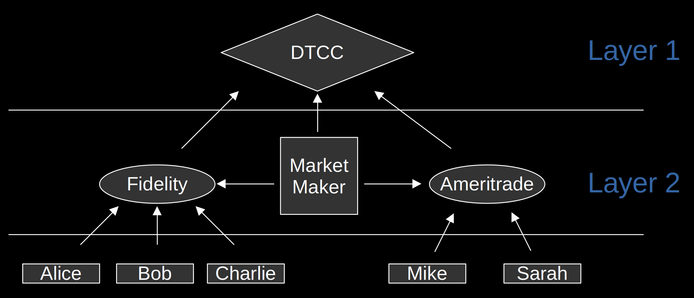

# The DeFi Hypothesis

## Introduction/Abstract

This hypothesis is meant to be a guiding compass on how to design blockchains so that they can reach
their full potential. While this hypothesis is ultimately just a prediction, it is grounded in first
principles and can be used to judge the soundness of different blockchain designs. The DeFi
Hypothesis itself is simple: 

*The blockchain that gets globally adopted will be one that 1\) built out its DeFi in layers (rather
than all on-chain) with the foundational DeFi layer prioritizing censorship resistance over
throughput, and 2\) has the DeFi layer 1 running directly on the blockchain's layer 1, as opposed to
a sidechain or layer 2\.*

Blockchains that violate \#1 will be uncompetitive against those that adhere to it, and blockchains
that violate \#2 will likely collapse once the block rewards (a.k.a. block subsidies) end. The first
blockchain to successfully build DeFi in this manner will have network effects take it all the way
to mass-adoption \- not even governments will be able to stop it. This blockchain's main asset will
then become the next global reserve asset \- finally ending the reserve asset curse that is
Triffin's Dilemma.

## Layering is the only way to scale

**All complex systems are built in layers. Just as atoms form molecules to enable complex life,
specialized layers build scalable ecosystems.**

The goal of DeFi is to eventually service the billions of people living on the planet, but no
blockchain's DeFi is currently able to support this scale. The current zeitgeist is experiencing a
debate between building DeFi in layers (e.g., Bitcoin and Ethereum), and building an incredibly fast
blockchain that can support it all (e.g., Solana, Sui, and Aptos). But according to the DeFi
Hypothesis, layering is the only viable option. First principle reasoning suggests the fast
blockchain approach is logically flawed.

The blockchain trilemma posits that no single system can maximize censorship resistance (termed
“decentralization”), security, and high-throughput simultaneously \- only two of the three are
achievable. Security is non-negotiable, leaving systems to choose between censorship resistance and
throughput. For a decentralized blockchain serving billions, this seems like a Catch-22: prioritize
resistance, and scalability falters; prioritize throughput, and trust erodes. Proponents of the fast
blockchain approach point to this Catch-22 when they argue that sacrificing some censorship
resistance is a necessary evil; there is no other way to scale DeFi to billions of users.

Yet this framing overlooks a critical distinction: the trilemma governs \*individual features\*, not
entire ecosystems. By isolating features into specialized components, a blockchain can bypass the
trilemma entirely, achieving both resistance and throughput within a cohesive whole. It is
effectively synergy: "the whole is more than the sum of its parts".

Consider a decentralized exchange (DEX) aiming to serve two niches: users demanding censorship
resistance and those requiring high-throughput. The trilemma suggests this is impossible \- boosting
throughput sacrifices resistance. Now imagine splitting this DEX into two: DEX A, optimized for
censorship resistance, and DEX B, tailored for high-throughput. Each DEX faces its own trilemma, but
DEX B's throughput gains no longer compromise DEX A's resistance. Users choose which DEX to use
based on preference \- resistant trades on DEX A, rapid trades on DEX B \- while the ecosystem as a
whole satisfies both niches.

Traditional finance (TradFi) has scaled to billions using the same principle which directly
contradicts the fast blockchain position. TradFi has absolutely no problem centralizing features
which means the blockchain trilemma doesn't apply to it. Yet even TradFi uses a layered approach.

**Figure 1:** TradFi Order Books

The above diagram depicts how TradFi stock trading is actually supported. TradFi segregates features
into distinct entities that specialize and work together. In fact, TradFi even separated out
settlement from all other features\! Settlement is handled by the Depository Trust & Clearing
Corporation (DTCC). It is a private U.S. company, but all it does is update account balances
whenever a trade is executed. Not only is it slow \- it takes 2 days for trades to settle (T+2) \-
but it also doesn't have liquidity services or best price enforcement. It leaves those features to
other specialized entities. This segregation allows each component to optimize for its niche,
forming a layered architecture where ubiquitous features, like settlement, underpin the rest.

And it's not just stock trading, TradFi uses layers everywhere:

> *“... in the United States we have FedWire as a gross settlement system between banks. It currently
> performs fewer than 20 million transfers per month ... Individuals don't directly use the FedWire
> base layer. Instead, we use payment methods like credit cards, debit cards, PayPal, Cash App, and so
> forth, and our banks record those transactions on their ledgers and then settle with each other
> later. Each FedWire transfer represents a batch of many smaller transactions from these higher
> layers.”*  
> – quote from Lyn Alden's "Broken Money", Chapter 22

Lyn Alden even points out that layering is not just used in finance: "the Internet Protocol … stacks
functions in four layers" ("Broken Money", Chapter 22). 

> [!IMPORTANT]
> Critics might point to liquidity fragmentation, as seen among Ethereum's general-purpose layer 2s
> (e.g., Arbitrum and Optimism), which struggle to interoperate. But Ethereum's difficulty to
> interoperate is actually due to \*how\* Ethereum's layer 2s are designed \- they are all
> general-purpose layer 2s. By contrast, specialized components sidestep this issue. For example, a
> specialized high-throughput layer can connect to a resistant base layer without the
> interoperability overhead of general-purpose designs.

The fast blockchain approach isn't just going against the grain, it results in a wholly
uncompetitive blockchain: why choose an application that is inherently more limited than another?
The layered approach can satisfy the censorship resistant niche and the high-throughput niche, but
the fast blockchain approach can only satisfy the latter.

## Censorship Resistance as the Foundation and Competitive Advantage

Whenever features are isolated into specialized components, the layering architecture naturally
emerges because some features are ubiquitously useful. In TradFi, this base feature is almost always
settlement. But in DeFi, it will be *censorship-resistant* settlement. This censorship-resistant
settlement will give DeFi a huge competitive advantage of TradFi.

Consider the split DEX example again. Between DEX A (censorship-resistant) and DEX B
(high-throughput), one will naturally emerge as foundational but which one? Since TradFi's
settlement layers are mostly used for processing large batches, the same will likely apply to DeFi.
This means the DEX that is better able to satisfy this niche will be the foundation.

Processing large batches requires large amounts of liquidity, so which DEX will have the most
liquidity available? Liquidity is derived from available wealth and wealth is correlated with time
horizons. *High-throughput suits short-term actors like day-traders, but most wealth resides with
long-term holders: central banks, pension funds, mutual funds, and high net-worth individuals.*

> [!IMPORTANT]
> If a central bank makes a 20 year investment, it is more concerned with whether it will be able to
> claim its profit in 20 years than whether its trade goes through within the next 5 seconds. In
> other words, it prefers censorship resistance.

DEX A, catering to censorship resistance, will attract greater liquidity, making it the natural base
layer. DEX B, with smaller but faster trades, can then tap DEX A's surplus liquidity through
targeted interoperability, creating the layered hierarchy where censorship resistance anchors
throughput.

But why does censorship-resistant settlement give DeFi a competitive advantage over TradFi? Consider
that in 2022, following Russia's invasion of Ukraine, the United States and its allies froze $300
billion of Russia's foreign reserves. This unprecedented move sent shock waves through the global
financial system, accelerating a "de-dollarization" effort as nations from China to India began
seeking alternatives to a reserve asset that could be weaponized against them. The lesson was clear:
a settlement system controlled by a single power \- or a coalition of powers \- carries an
existential risk for any holder. No nation wants its economic lifeline severed at the whim of a
geopolitical rival. So if given the choice between plain settlement and censorship-resistant
settlement, nations will strongly prefer the latter.

> [!IMPORTANT]
> TradFi settlement layers are not as cheap as some people expect \- they charge way more than
> $0.001 per trade. The DTCC charges $0.68 for day delivery of securities trades ([DTCC source](https://www.dtcc.com/-/media/Files/Downloads/legal/fee-guides/DTC-Fee-Schedule.pdf)), and
> FedWire charges $0.97 per transfer ([FedWire source](https://www.frbservices.org/resources/fees/wires-2025)). Some decentralized blockchains
> are already capable of offering comparable fees, and also have the advantage of including
> censorship-resistance with each transfer.

## Layer 1 DeFi as the Blockchain Stabilizer

While all blockchains can support DeFi in some form \- whether on layer 1 or layer 2 \- the choice
carries existential stakes for a blockchain's long-term stability and viability. To see why,
consider how all blockchains launch with a reserve pot \- block rewards \- to fund security in their
infancy. Over time, as rewards diminish, transaction fees must take over to pay block producers
(miners or validators). This shift, illustrated below, ties a blockchain's long-term security to its
utility:  

**Figure 2:** Rewards vs Fees

Initially, block rewards dominate producer revenue, but as they taper (e.g., Bitcoin's halving
cycle), fees from on-chain activity must rise with adoption. If they don't, security falters once
rewards end \- leaving the blockchain vulnerable to collapse or centralization. No blockchain has
yet proven it can thrive post-subsidy; even Bitcoin, the most established, remains [90-99%
subsidized](https://mempool.space/graphs/mining/block-fees-subsidy) in 2025\. 

*The DeFi Hypothesis asserts that only layer 1 DeFi can generate the transaction volume needed to
sustain a blockchain long-term.* Relying solely on layer 2 for DeFi deprives the base layer of fees,
as off-chain transactions do not meaningfully contribute to paying layer 1 block producers.

Real-world data seems to corroborate this stance. Consider Ethereum: despite a market cap \~8x
smaller than Bitcoin's, its daily transaction volume is \~4x higher ([Bitcoin
source](https://www.blockchain.com/explorer/charts/n-transactions), [Ethereum
source](https://etherscan.io/chart/tx)). They both support layer 2 DeFi, but Ethereum also supports
DeFi directly on Ethereum's layer 1\. Though costly and constrained, Ethereum's layer 1 smart
contracts drive lending, trading, and more \- fueling on-chain activity. 

> [!NOTE]
> Bitcoin's [average transaction fee](https://ycharts.com/indicators/bitcoin_average_transaction_fee) is 4x higher than
> [Ethereum's](https://ycharts.com/indicators/ethereum_average_transaction_fee) so one might argue
> the fees account for the difference in transaction volume. However, Cardano's [average transaction fees](https://cardanoscan.io/analytics/dailyTxCountAndFees) are even smaller than Ethereum's; yet
> Ethereum has 10x the transaction volume of Cardano. This data suggests lower transaction fees are
> not the cause of the discrepancy, but rather Ethereum's more robust layer 1 DeFi activity.

This stance does not contradict the prior layering sections because only the DeFi layer 1 needs to
exist on the blockchain layer 1, and this is doable without sacrificing decentralization. Consider
that in 2021, the DTCC averaged [106 million transactions per day](https://www.dtcc.com/-/media/Files/PDFs/White%20Paper/DTCC-Accelerated-Settle-WP-2021.pdf) and
FedWire averaged [811,472 per day](https://www.frbservices.org/resources/financial-services/wires/volume-value-stats/annual-stats.html).
Supporting both directly on-chain only requires a TPS of 1,300\! Even if the TPS for the blockchain
was modestly bumped to 3,000 (still a far cry away from Solana's 60,000), some blockchains have
invented ways of reaching this throughput *without* sacrificing censorship-resistance (e.g.,
Cardano's
[Leios](https://iohk.io/en/research/library/papers/high-throughput-blockchain-consensus-under-realistic-network-assumptions/)).

> [!IMPORTANT]
> The TPS of 1,300 is only needed immediately if the DeFi layer 1 was mass-adopted tomorrow\! Since
> adoption will actually play out over years, if not decades, the decentralized blockchain's
> throughput can be slowly scaled up to the required TPS.

Now compare the demand from the DTCC and FedWire to Ethereum's average daily transaction count of
[1.2 million](https://etherscan.io/chart/tx) and Bitcoin's average daily transaction count of
[250,000](https://www.blockchain.com/explorer/charts/n-transactions) that same year. Just these two
DeFi settlement applications would more than \~100x Ethereum's transaction volume and \~400x
Bitcoin's\! The revenue generated from the DeFi layer 1 activity alone should be enough to sustain
blockchains post-rewards, especially low-cost Proof-of-Stake blockchains.

> [!IMPORTANT]
> Bitcoin has taken the approach of forcing all DeFi activity into layer 2s because it is cautious
> of the risks introduced by smart contracts. However, there doesn't seem to be another way to
> generate enough transaction volume to cover the blockchain's security. Bitcoin's layer 2 DeFi is
> still fairly young so it is possible that it just needs a bit more time, but this DeFi Hypothesis
> predicts it won't be enough \- especially considering the high-costs of Proof-of-Work.

## Unstoppable Cascading Adoption

**Once a blockchain has built out the DeFi layer 1 for its own ecosystem, its DeFi ecosystem begins
to incentivize its own cascading adoption, starting in regions with unstable institutions (e.g.,
nations facing hyperinflation or corruption).** 

For example, without trusted institutions to manage credit histories, users will happily adopt the
trustless credit histories enabled by the DeFi layer 1\. Credit histories are the foundation of
economic identities, and critical for entrepreneurship and wealth accumulation. Enabled by mobile
apps or local entrepreneurs building on the DeFi layer 1, these trustless credit histories will gain
traction among tech-savvy citizens desperate for economic tools beyond unreliable institutions.

Not only is TradFi unable to supply credit histories to these troubled regions, but even if it
could, it would be inferior. TradFi's implementation of credit histories is subject to "identity
theft", and is more expensive to operate (i.e., funding institutions costs billions per year).
Conversely, DeFi based credit histories are protected by encryption, and are virtually free to
operate (i.e., they piggy-back off of the blockchain's transaction history).

This reasoning \- *TradFi is unable to supply a feature to a troubled region, but even if it could,
it would be inferior* \- applies to other features as well, like trustless asset swaps and loans.
Citizens of these areas will happily accept the limited features of the DeFi layer 1 because there
is no alternative for them. The DeFi layer 1 enables them to leapfrog over the institutions holding
them back. And **the self-custody of blockchains combined with the censorship-resistance of the DeFi
layer 1 means corrupt governments cannot stop them.**

Adoption snowballs from there: with users interacting with the feature-bare DeFi layer 1, there is
demand for entrepreneurs to build DeFi layer 2s and other businesses to fill the void. With access
to the basic peer-to-peer loans and credit histories of the DeFi layer 1, entrepreneurs can get the
startup capital necessary to actually build larger projects. With this, these formerly troubled
nations will begin to experience [catch-up growth](https://www.investopedia.com/terms/c/catch-up-effect.asp) \-
a term used to describe the rapid growth seen in poorer nations once obstacles (e.g., unstable institutions) are eliminated.

Other nations that were initially hesitant to adopt DeFi will see this incredible growth and quickly
adopt it, as well. The world will start to see 4, then 5, then 6 poorer nations all adopt DeFi and
experience catch-up growth. This is the point when the wealthier nations will take notice \- they'll
start to see their global share of economic activity shrink relative to these other nations. Wealthy
nations will be forced to innovate on their legacy TradFi infrastructure just to stay relevant on
the global stage \- that means replacing their expensive institutions with DeFi.

From start to finish, DeFi adoption cascades \- fueled by natural incentives. All it needs is the
initial spark from building a DeFi layer 1 that is worthy of building on.

> [!IMPORTANT]
> There is a belief that, when the dust settles, it will be a multi-chain world (i.e., more than one
> decentralized blockchain layer 1 will be adopted). But this belief contradicts both network
> effects and human nature. The most likely outcome is that there will be a single dominant
> decentralized blockchain layer 1 that then supports sidechains and layer 2s. Moving between two
> separate decentralized blockchain layer 1s (e.g., Bitcoin and Ethereum) will be more costly,
> risky, and inconvenient – think fees, bridge hacks, and delays, even with improving
> interoperability protocols – than remaining within a single decentralized blockchain ecosystem.
> Unless there is a unique characteristic of the second blockchain (e.g., Facebook vs Instagram),
> users won't migrate between them. Instead, if bridges are created, capital will mostly flow in one
> direction – towards the ecosystem with the most utility. The DTCC perfectly exemplifies this
> “winner-take-all” dynamic: despite it being a U.S. based company, it handles trades for most of
> the world ([source](https://www.dtcc.com/asset-services)).  

## A New Global Reserve Asset

As the unstoppable cascading adoption of DeFi plays out, the most important currency in the DeFi
ecosystem will start to be held as a reserve asset, too. The most likely candidate for this will be
the host decentralized blockchain's main asset (i.e., the one used for transaction fees) since it
effectively powers the whole DeFi ecosystem. Plus, the asset will most likely have a fixed supply
which makes it a great store of value (i.e., "digital gold").

The following table shows the U.S. dollar isn't technically the only reserve asset, it just has the
largest share by far:

| Currency | Reserve Share |
| :---: | :---: |
| U.S. Dollar | 59% |
| Euro | 20% |
| Yen | 6% |
| Pound Sterling | 5% |
| Canadian Dollar | 3% |
| Australian Dollar | 2% |
| Renminbi | 2% |
| Other | 4% |

**Table 1:** Reserve Asset Rankings in 2024 ([source](https://www.visualcapitalist.com/ranked-the-worlds-top-reserve-currencies-in-2024/))

Currencies from other wealthy nations are also used in small amounts. At first, the decentralized
currency won't be more than a blip in the rankings since the poor nations that adopt it won't have
large enough amounts to be significant. But as more nations adopt DeFi and begin to use this
currency for it, more and more will begin to hold it in reserves. It will be a slow process (playing
out over decades), but over time, it will climb the rankings.

*Eventually, the decentralized currency will challenge the U.S. dollar's dominance.*

From a game-theoretic perspective, the expected winner is clear. A nation can either choose the U.S.
dollar, and be subject to the political whims of the United States, or it can adopt the politically
neutral and unseizable decentralized currency. But actually, this time the choice won't entirely be
up to governments; people will have a say.

In TradFi, almost all wealth is held in centralized institutions because people would rather store
wealth in insured and secure institutions than risk storing it under their mattresses. While
convenient, this "centralized custody" makes it possible for governments to freeze and seize money
whenever they choose. As a result, governments can currently choose which assets people are allowed
to hold. For example, the U.S. banned private gold ownership in 1933
([source](https://en.wikipedia.org/wiki/Executive_Order_6102)); centralized custody of gold was what
made it enforceable. 

Decentralized blockchain currencies flip this dynamic. Encryption makes self-custody simple and
secure. Imagine if in 1933, 70% of gold was centrally stored. Now imagine a future where 70% of a
decentralized currency is self-custodied. If a corrupt government tried to outlaw use of this
currency, how could it enforce the law? Door-to-door confiscation of encrypted assets isn't
practical \- some might comply, but many wouldn't. And since transactions are fully peer-to-peer,
there is also no way to entirely stop the currency's use in market activity. 

So even if some government institutions choose to use the U.S. dollar, individual people all over
the world can choose the decentralized currency; and not even the United States' powerful military
can stop them.

## The End of Triffin's Dilemma

> [!NOTE]
> While the following section is still meant for the layman, it is heavy in economic theory. The
> premise is: **Triffin’s Dilemma has been plaguing the world, and a decentralized global reserve
> asset is the first potential cure for it.**

The world is currently stuck in a cycle \- one that is arguably comparable to the long-term debt
cycle described by Ray Dalio.

- **Phase 1:** A nation becomes so reliable and economically dominant that its currency becomes the global reserve.    
- **Phase 2:** This status forces a massive trade imbalance \- the nation must import far more than it exports to supply the world with its currency.    
- **Phase 3:** The imbalance hollows out the nation's manufacturing base, rotting its economic core.    
- **Phase 4:** The rot spreads until the nation is neither reliable nor dominant.    
- **Phase 5:** Trust in the nation collapses, and the reserve mantle passes to a new nation, restarting the cycle.

In layman's terms, *Triffin's Dilemma* refers to how the reserve currency status inevitably results
in the controlling nation rotting from the inside out. Most people recognize that the Trump movement
in the United States is a symptom of a larger problem; but when people are pressed for what that
problem is, they struggle to identify it. **One could easily argue the problem is that Triffin's
Dilemma is playing out in the United States.** A significant portion of Trump's voter base is
comprised of the U.S. workers who lost their jobs due to the hollowing of the U.S. manufacturing
base.

> [!IMPORTANT]
> Non-reserve currencies avoid Triffin's Dilemma thanks to normal market dynamics. If Nation A
> excels at manufacturing, others want its goods \- and thus its currency (to use for buying those
> goods). This demand strengthens Nation A's currency, making its manufacturing less competitive, so
> some jobs shift to nations with weaker currencies. But as Nation A produces less, demand for its
> currency dips, weakening it and luring manufacturing back. Like a pendulum, the system swings
> toward balance.

But for a global reserve currency, the pendulum breaks. As manufacturing hollows out, demand for the
currency doesn't fade \- other nations still want the currency for reserves, trade, and stability,
not just direct business with the issuer. Therefore, the manufacturing rot deepens without
correction.

People tend to blame "corrupt" corporations for this outsourcing of jobs, but the fact of the matter
is the global system is fundamentally designed to incentivize this outcome. If another nation's
currency eventually replaces the U.S. dollar as the reserve currency, that nation will likely suffer
the same fate as the United States. The world needs a way to break this depressing cycle.

Some economists argue that the *special drawing right* (SDR) proposed by the IMF could be an
alternative reserve asset to the U.S. dollar, but the SDR would not be a solution to Triffin's
Dilemma because the SDR is fundamentally just a basket of nation state currencies. The underlying
nations would still suffer from Triffin's Dilemma (although more slowly). The same reasoning also
disqualifies fiat-backed stablecoins as a solution to Triffin's Dilemma.

What about resurrecting physical gold as the global reserve? Technically, gold is stateless which
means it is also a solution to Triffin's Dilemma. However, gold has a fatal flaw \- it is a physical
asset. This means it can only be transported by foot, truck, boat, or plane. Yet, real economic
transactions \- due to their digital nature \- can occur at the speed of light. On a global scale,
this difference is a problem\!

Imagine if someone in the U.S. hired someone from Germany to create a website for them. If payment
was in gold, it could take a month or longer for the German to get paid\! In the digital age, this
is too large of an inconvenience. That is why the world would rather rely on fiat \- with all of its
downsides \- than gold. As Lyn Alden writes in Chapter 8 of "Broken Money":

This is the only time in history where, on a global scale, a weaker money won out in terms of
adoption over a harder money. And it occurred because telecommunication systems introduced *speed*
as a new variable into competition. Gold ... couldn't compete with ... top fiat currencies with
their combination of speed and convenience ...

Decentralized blockchains offer the first modern solution to Triffin's Dilemma because they offer
the possibility for a truly stateless currency that can be settled almost as fast as actual economic
transactions. Decentralized blockchain currencies are a categorical upgrade over physical gold \-
hence the term "digital gold". Digital gold levels the playing field again between fiat currencies
and fixed supply assets, which means the world will once again choose the harder asset.

A frequent objection to a decentralized blockchain currency as a global reserve is the belief that
its circulating supply must be elastic \- able to expand or contract with credit cycles \- to avoid
economic stagnation. Critics often cite the gold standard's role in the 1929 Great Depression as
proof. Yet this is a fundamental misunderstanding of history. The real issue was that the gold
standards were not floating exchange rates \- they were pegged at fixed values. This meant price
discovery was not able to signal stress in the system until it became catastrophic.

Consider a basic example where the U.S. dollar is statically pegged to gold at $20/ounce. But
fractional reserve banking still exists so credit increases the dollar supply in the system.
Shouldn't the value of gold shift like all other assets? By using a static gold peg, the supply of
U.S. dollars could double and gold would still be priced at $20/ounce while the price of all other
assets inflated. The point of the gold peg was to constrain excessive money printing, but how is a
**static peg** supposed to curb unchecked credit expansion by banks? Only a floating exchange rate
could reflect real-time pressures. 

There were a lot of reasons why the Great Depression was so bad (e.g., bank runs, policy blunders,
etc.), but the static peg amplified the Depression's chaos by masking early warnings. If the gold
peg was allowed to float and people saw the price of gold increase, this would be a visible sign
that money printing is getting out of hand. Governments could have stepped in long before the
situation got bad enough to cause the cascading failures of the Great Depression. If it did, the
U.S. could have just experienced a mild recession in the early 1920s instead of a full blown
depression a decade later. The key point is that, in order to know whether money printing is getting
out of hand, society needs reliable real-time signals. A static peg fundamentally masks these
signals.

*The reserve currency's supply can be a fixed supply as long as the exchange rates between it and
fiat currencies are allowed to float.* While fixed-supply assets may raise concerns about
deflationary pressures, floating exchange rates with fiat allow market signals to adjust fiat credit
availability, mitigating stagnation risks without requiring elastic issuance.

> [!NOTE]
> Interestingly, the Trump administration is reportedly considering revaluing the U.S. gold stock \-
> currently pegged at $42/ounce \- to a higher static value. Yet there's no discussion of letting
> its price float. This echoes the static peg flaw: a one-time adjustment, not a market-driven
> signal.

When the idea of a fiat currency pegged to "digital gold" comes up, some skeptics ask: Why would
governments honor pegs that curb their power? What prevents a “Nixon 2.0” from severing the link
again? The answer: \*breaking a peg to a decentralized currency isn't feasible\*.

Just like when the U.S. outlawed private gold ownership in 1933, Nixon was only able to break the
gold standard in 1971 because of the centralized custody of gold at the time. Nations held U.S.
dollars, but the gold it was pegged to was being centrally held by the U.S. Federal Reserve. Nixon
never would have had the power to break this peg if nations and people self-custodied their gold.

> [!IMPORTANT]
> This is also why a gold-backed stablecoin will not work as a global reserve asset\! The underlying
> physical gold will likely still end up in centralized custody which creates the opportunity to
> break the peg at any point.

## A Better World

Most people don't think about the impact of finances in their day-to-day lives; but whether we like
it or not, money matters. The current global financial system is dying: wealthy nations are now
excessively printing money, and wealth inequality is growing at a rapid rate fueled by the
[cantillon effect](https://www.morpher.com/blog/the-cantillon-effect).

But the most destabilizing force in the world right now is arguably Triffin's Dilemma \- the United
States has taken a protective, inward focus as a desperate attempt to reverse the toxic effects of
the reserve asset curse. The global trade era relied on the active involvement of the U.S., and now
that stabilizing force is gone. Even the excessive U.S. government debt would have never been
possible if it wasn't for the international dollar demand created by the reserve asset status;
without it, the bond market likely would have rebelled a long time ago.

Luckily, ending the toxic influences of Triffin's Dilemma doesn't require the United States to
recognize a new stateless reserve currency; the demand for the U.S. dollar will continue to fall
while the new reserve asset's adoption grows. This is fantastic because it means the U.S.
manufacturing base can start recovering long before its political class chooses to acknowledge the
new paradigm \- they will likely be the last to acknowledge it.

> [!NOTE]
> While this at first may seem like a U.S.-centric perspective, a new reserve asset is also
> fantastic for the rest of the world because it means the U.S. can't weaponize the dollar anymore.
> It's in everyone's best interest for the U.S. to give up its global reserve status.

Just like how the DeFi ecosystem naturally incentivizes its own adoption once the spark is lit, the
global financial system \- plagued by Triffin's Dilemma \- will also naturally start healing itself.
All it takes is one blockchain willing to follow the DeFi Hypothesis.

## Conclusion

The DeFi Hypothesis is the full story: if you build a blockchain the right way, mass-adoption will
necessarily follow due to its overwhelming utility advantages. Things like first-mover advantage and
government policies may slow the process; but if the DeFi Hypothesis is correct, they cannot stop
it. And since this hypothesis is supposed to be grounded in \*universal truths\*, it should not be
possible for any technological disruption to derail any part of it; if one does, the DeFi Hypothesis
should be considered false.

> [!IMPORTANT]
> This paper deliberately didn't discuss blockchain governance because it is a nuanced topic and it
> doesn't change the underlying conclusion \- DeFi must be built out as described here. Bad
> governance can kill the DeFi ecosystem, but good governance cannot make-up for a flawed approach
> to DeFi. Therefore, flawed governance should not be seen as invalidating this DeFi hypothesis.
